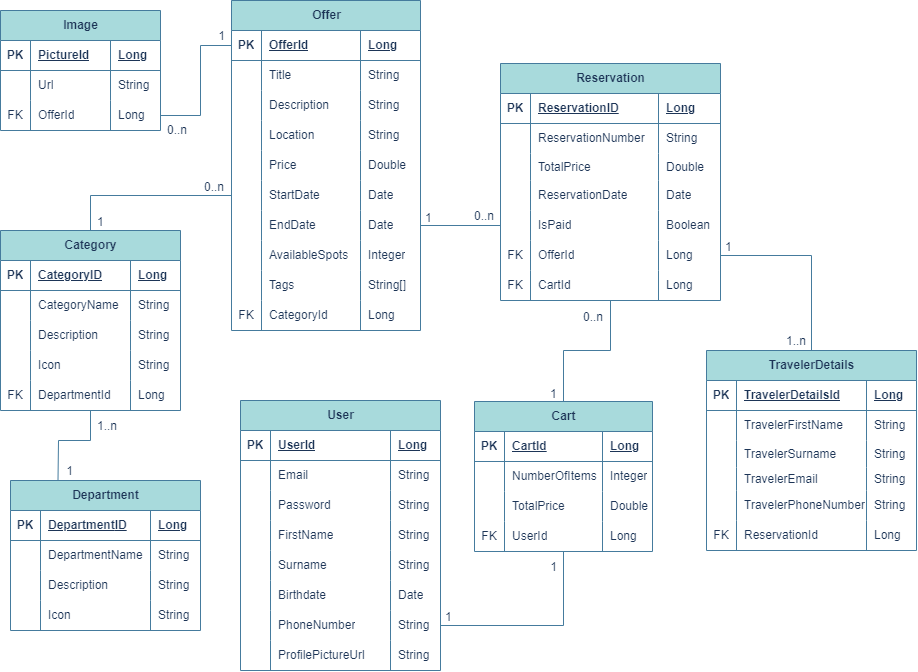
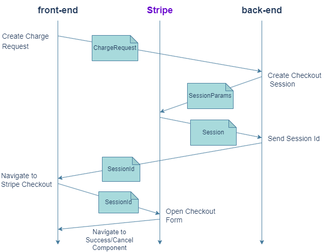
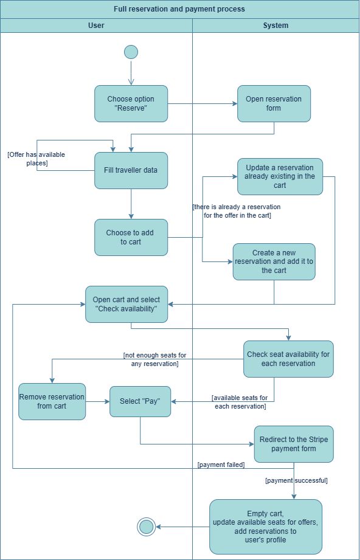

# 🌍 TravelWise

TravelWise is a full-stack web application that allows users to browse travel offers, make purchases, manage reservations and explore recommendations. 
Built with Spring Boot, PostgreSQL, Angular and fully containerized using Docker.

# Tech Stack
## 🍃 Backend
* **Spring Boot 3**
* **Java 21**
* **JPA / Hibernate**
* **REST API**
## 🅰️ Frontend
* **Angular 17+**
* **Nginx (serving production build)**
## 🐘 Database
* **PostgreSQL 16**
* **SQL dump auto-loaded via Docker**
## 🐳 Infrastructure
* **Docker & Docker Compose**
## 💳 Payments
* **Stripe API (Checkout / PaymentIntents)**
## ☁️ Media Storage
* **Cloudinary (Image Upload)**
# 📦 Project Structure
```
root/
│── docker-compose.yml
│── TravelWise-frontend/
│   ├── Dockerfile
│   ├── nginx.conf
│   └── Angular source...
│
└── TravelWise-backend/
├── Dockerfile
├── src/main/resources/db/travel_wise_dump.sql
└── Spring Boot source...
```

# 🐳 Running the App with Docker

This project is fully **dockerized**.

It runs inside containers, so Docker Desktop must be installed AND running.

You can start **frontend** + **backend** + **database** with a single command:
```
docker compose up --build
```
**✔ What this does:**

| Service         | URL                                                    | Description                 |
| --------------- | ------------------------------------------------------ | --------------------------- |
| **Frontend**    | [http://localhost:8081](http://localhost:8081)         | Angular app served by Nginx |
| **Backend API** | [http://localhost:8080/api](http://localhost:8080/api) | Spring Boot REST API        |
| **Postgres**    | localhost:5432                                         | PostgreSQL container        |

The database automatically initializes using the SQL file:
```
TravelWise-backend/src/main/resources/db/travel_wise_dump.sql
```

⚠️ Windows Users: Stop Local PostgreSQL Service

If you have PostgreSQL installed locally on Windows, the Windows PostgreSQL service will block port 5432.
You must stop and disable the Windows PostgreSQL service before running Docker.
# DataBase Schema

# Stripe Payment Sequence Diagram

# Reservation and Payment Activity Diagram
